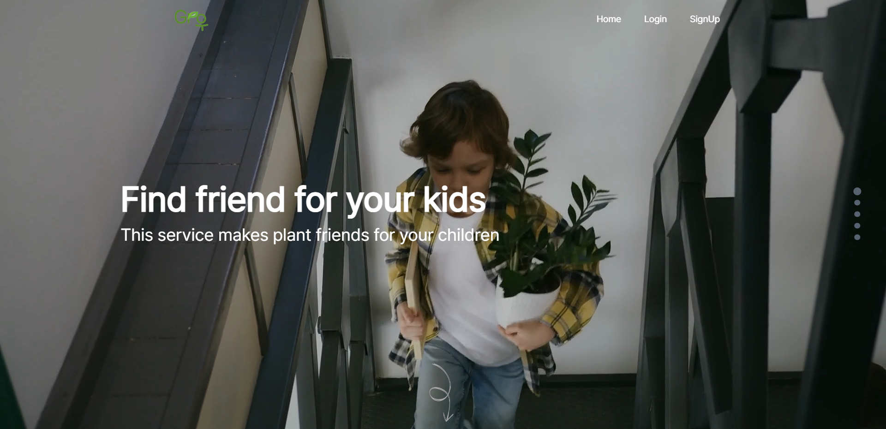
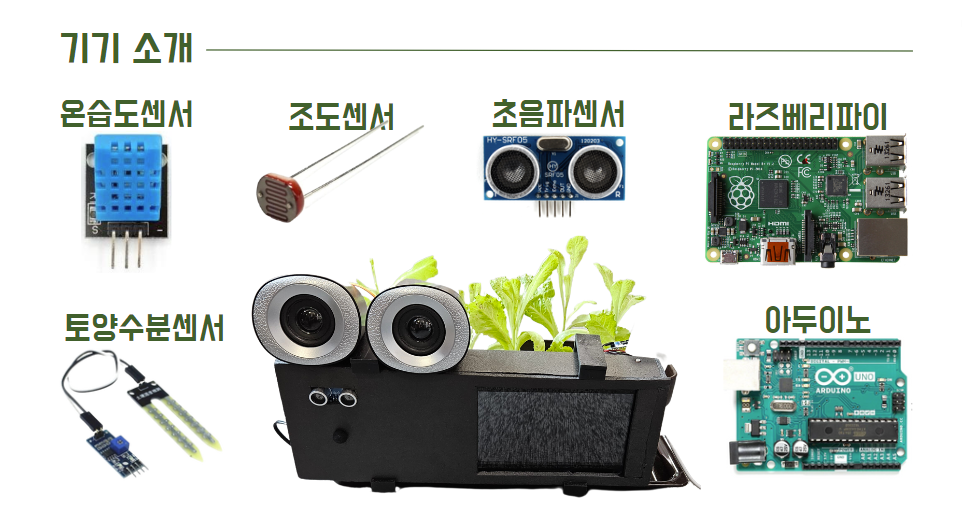
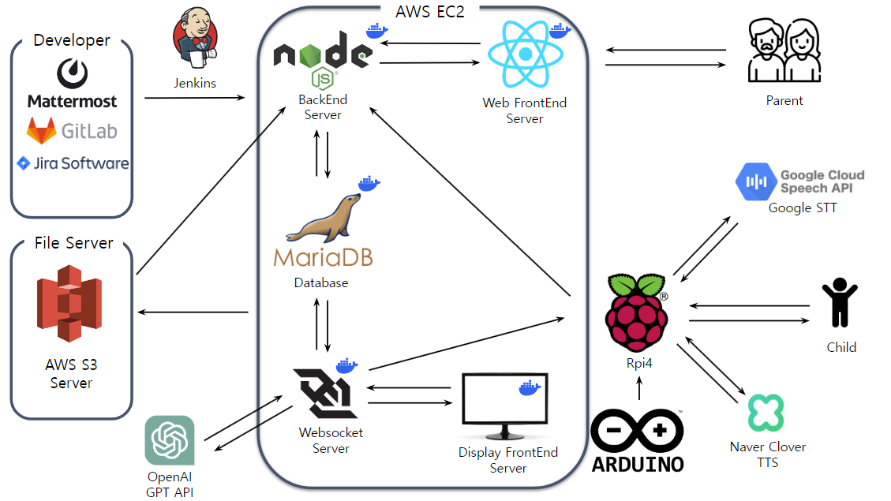
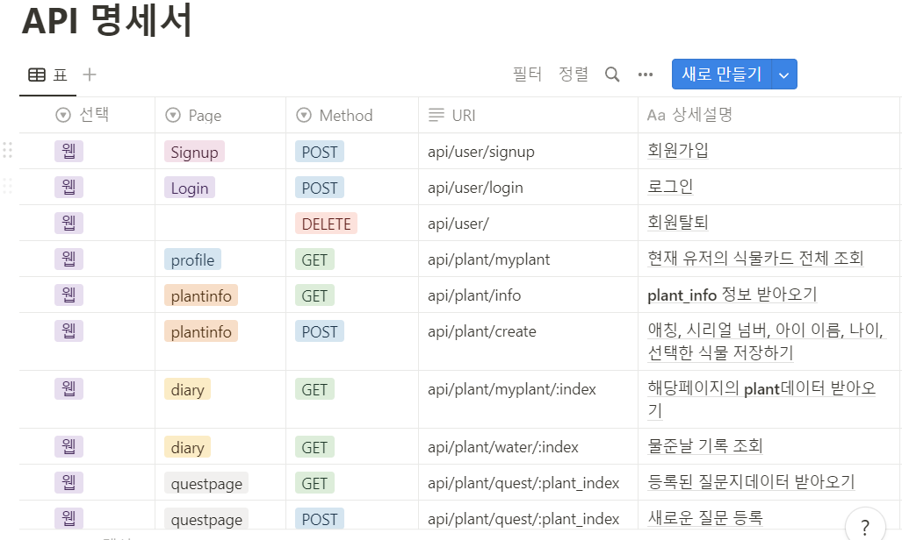
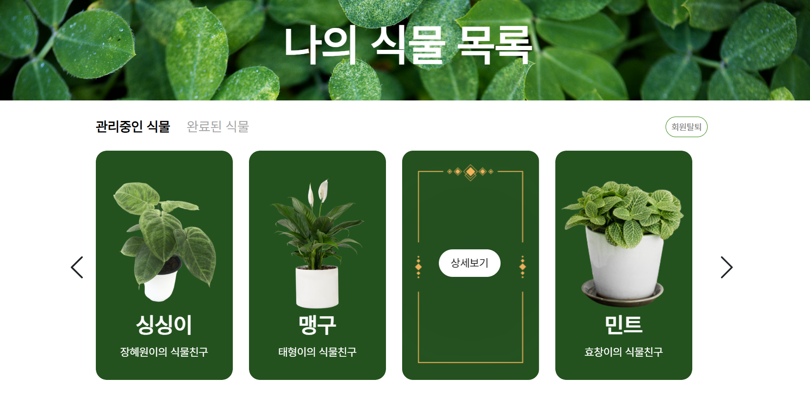
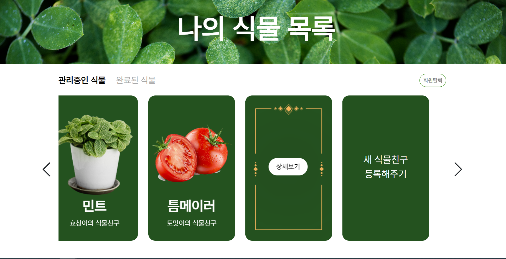
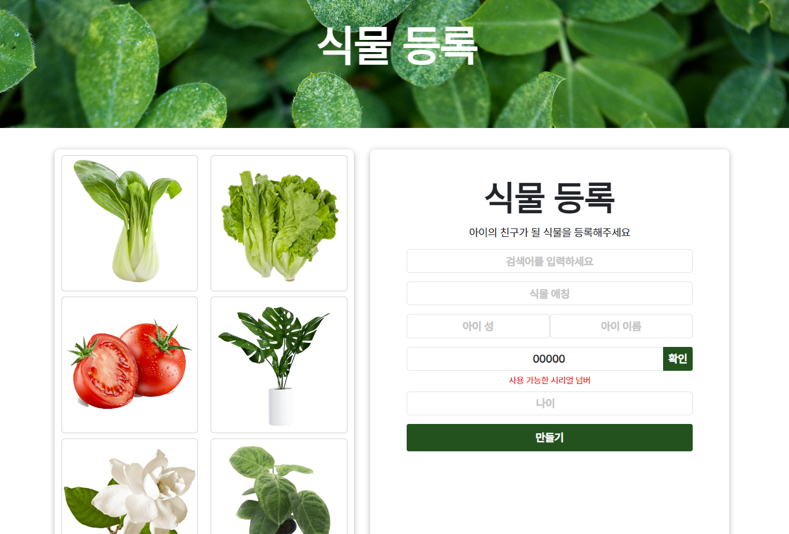
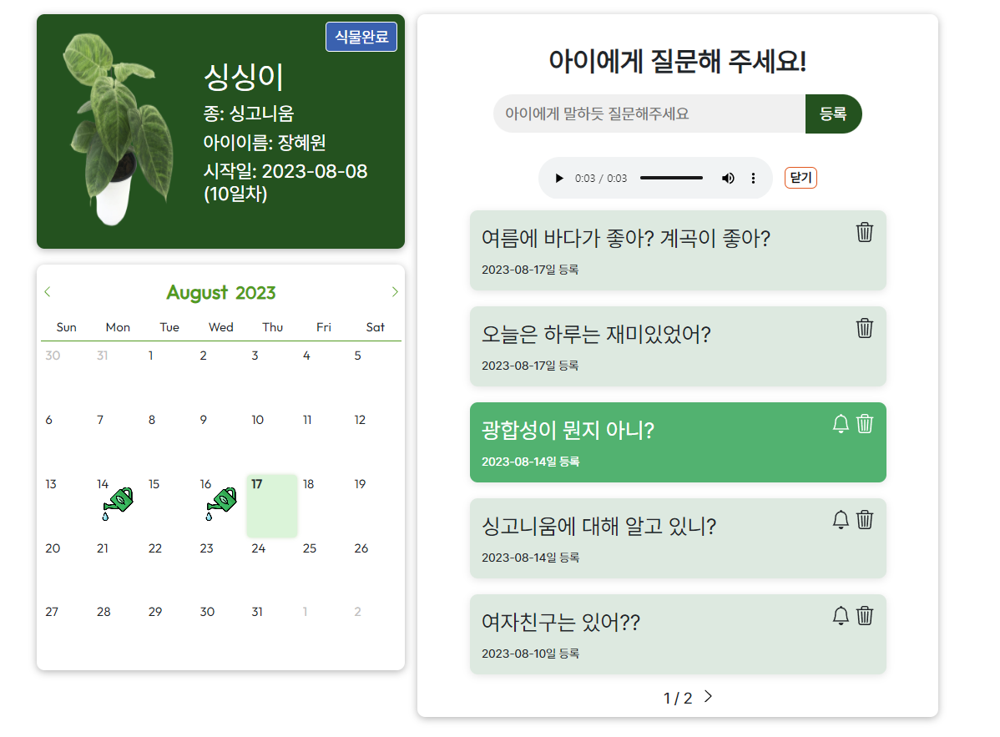
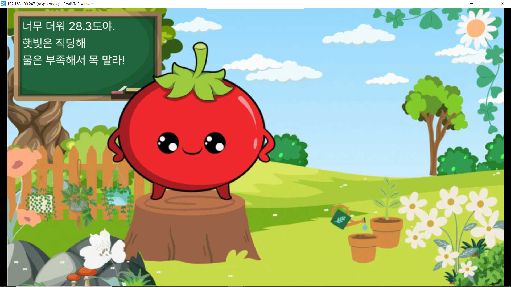
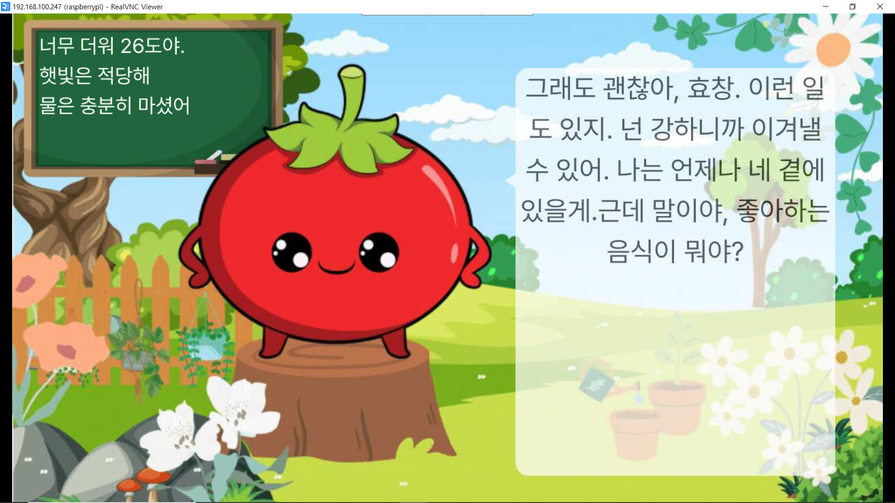

  

# 속닥속닥 식물친구 , Grow 

---

### 1 :four_leaf_clover: 프로젝트 개요

:four_leaf_clover: **개발 기간**

| 개발기간 | 2023.07.10 ~ 2023.08.18 (6주) |
| -------- | ----------------------------- |

:four_leaf_clover: **팀원 소개**

| 팀원   | 역할                  |
| ------ | --------------------- |
| 용효창 | 팀장, IoT , 배포      |
| 강신욱 | BE, DB, websocket, AI |
| 김민국 | display, websocket    |
| 김태형 | 부팀장, FE, Jira      |
| 박성민 | Iot, TTS             |
| 장혜원 | FE, 디자인            |

:four_leaf_clover: **기획 의도**

| 코로나 이후 국내 홈가드닝 시장의 성장과 2023년 식물재매 시장 5000억원 규모 예상 |
| ------------------------------------------------------------------------------- |
| 전국 지자체에서 반려식물 활성화 사업 진행중                                     |
| 아이의 정서교감 및 안정을 심어주기 위해서                                       |

:four_leaf_clover: **목표**

| Grow 서비스를 통해서 아이의 정서 발달을 도움 |
| 부모가 아이를 더욱 잘 이해할 수 있도록 도움을 주는 소통창구 역할 |

---

### 2️ :four_leaf_clover: 서비스 기능 소개

:moyai: **대표기기**

:four_leaf_clover: **대표기능**

- 아이와 식물과의 실시간 대화기능 :speaker:
- 부모의 질문지 등록 :thought_balloon:
- 대화중 질문지에 등록된 질문을 실행 후 대답을 부모가 들을 수 있음 :ear:
- 수분, 조도 센서로 식물 관리
   

:four_leaf_clover: **메인기술**

## STT

- 아이의 음성을 받아서 음성을 텍스트로 변환
- 초음파 센서로 거리를 감지후 사용자의 존재여부를 파악
- 사용자가 근접한 경우 녹음을 시작
- 사용자가 멀어진 경우 녹음을 종료

## TTS

- gpi에서 받아온 텍스트를 아이의 목소리로 변환하여 읽어줌
- 클로바 API 선택 : 다양한 어린이 음성을 사용하기 위해서
- 사용자 질문 여부를 함께 전달하여 해당 답변의 저장 여부를 결정

## sensor

- 아두이노를 통해 조도 센서, 수분 센서, 온습도 센서의 값을 측정
- 측정된 값을 시리얼 통신을 사용하여 라즈베리 파이로 전송
- 라즈베리 파이에서는 REST API를 활용하여 센서데이터를 백엔드 서버로 전송

## GPT
- 프롬프트를 통해 어린아이에 시선에 맞는 대화가 가능
- 히스토리를 저장해 줌으로서 과거의 대화를 기억
- 적절한 타이밍에 맞춰 사용자 질문을 대신 수행

### 3️ :four_leaf_clover: 주요 기술 스택

## 주요 기술

- **_AWS S3_**
  - AWS에서 제공하는 파일 저장과 전송에 특화된 서버
  - 이후 백엔드 서버에서 파일의 이름으로 요청을 보내면 그 파일에 해당하는 URL을 반환하며, 백엔드는 그 URL을 프론트로 전송
- **_OPEN AI Chat API_**
  - OpenAI사에서 제공하는 챗봇 API
  - 아이와의 대화를 구현하기 위해 사용하여 상황에 맞는 말을 생성
  - 센서 데이터를 포함한 데이터를 전송받아 식물의 상황에 맞는 대화가 가능함
- **_web Socket_**
  - 실시간 센서 데이터 iot, 백앤드 전송
  - 실시간 센서테이터 백앤드 , 디스플레이 전송
  - web Socket 두개를 통해서 iot, 백앤드 , 프론트의 유기적인 데이터 전송
- **_React_**
  - 다양한 라이브러리와의 호환성 , 컴포넌트 기반의 가독성 높기 떄문에 선택
  - RESTful, axios를 통한 백엔드와의 데이터 전송방식 선택
  - bootstrap, mui, scss등 다양한 css방식 사용
- **_Redux-toolkit_**
  - 상태를 더욱 쉽게 예측가능하게 하기 위해서 도입
  - Redux-toolkit으로 데이터 store에 저장 후 사용
- **_Node.js_**
  - 백엔드 구축을 위해 사용
  - 웹소켓 백엔드 서버와 REST API 백엔드 서버에 모두 사용
- **_MariaDB_**
  - DB구축을 위해 사용
  - 관계형 데이터베이스로, mysql과 같은 문법을 사용하여 쉽게 사용할 수 있음

### 4️ :four_leaf_clover: 아키텍처

### 5 :four_leaf_clover: API 명세서

  

---

### 6 :four_leaf_clover: 서비스 화면

:four_leaf_clover: **웹페이지 설명**

- 식물 목록 확인

1. 키우는 식물 리스트 확인
2. 완료된 식물 리스트 확인

- 식물 등록

1. 새 식물등록하기 버튼으로 식물등록 페이지 이동

- 식물 등록 페이지

1. 새 식물 등록하기
2. 시리얼 넘버 체크
3. 식물 검색기능

- 식물 상세보기
 
1. 식물의 물 준 데이터 저장 
2. 질문지 등록 
3. 질문의 답 음성 듣기 
4. 식물 완료 처리

---

:four_leaf_clover: **디스플레이 설명**

- 기본 페이지

 

- 식물의 물 부족 표시 페이지

 

- 식물과 아이의 대화

 

---

### 7 :four_leaf_clover: 기대효과

- 식물 키우기를 통한 아이의 정서발당
- 부모가 자녀를 이해하도록 돕는 도구

 
 
